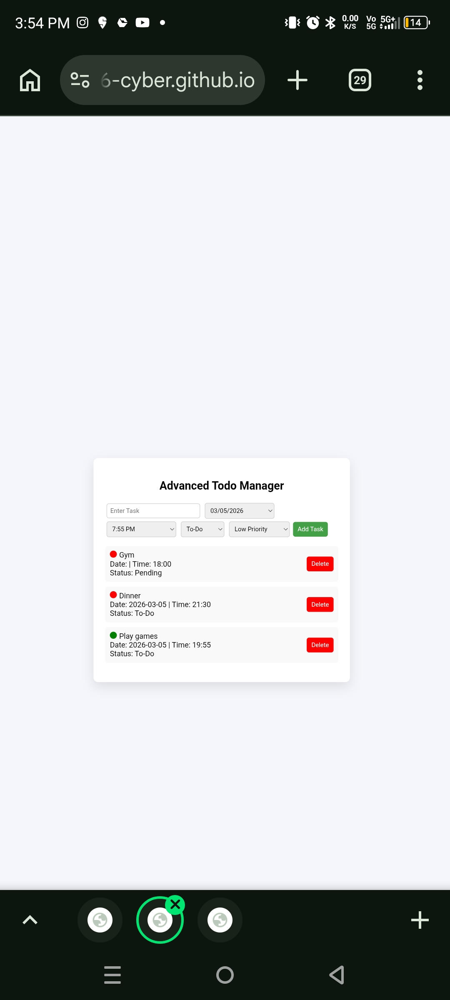

# Advanced Todo Manager

A **professional and modern Todo List Web Application** built using **HTML, CSS, and JavaScript**.
This project helps users manage their daily tasks efficiently with **date scheduling, time management, status tracking, and priority indicators**.

The application stores tasks using **Local Storage**, so tasks remain saved even after refreshing the browser.

---

## 🚀 Live Demo

👉 [View Live Project](https://samarthsethi66-cyber.github.io/my-to-do-project/)

---

## 📸 Screenshot




---

## Features

* Add new tasks easily
* Set **Date and Time** for each task
* Multiple **Task Status options**

  * To-Do
  * Started
  * Running
  * Pending
  * Complete
* **Priority indicator with colors**

  * Red → High Priority
  * Orange → Medium Priority
  * Green → Low Priority
* Delete tasks
* **Local Storage support** (tasks stay saved after page refresh)
* Clean and simple **professional UI**

---

## Technologies Used

* HTML5
* CSS3
* JavaScript (Vanilla JS)
* Local Storage API

---

## Project Structure

```
todo-project
│
├── index.html      # Main application file
├── style.css       # Styling (if separated)
├── script.js       # JavaScript logic
└── README.md       # Project documentation
```

---

## How to Run the Project

1. Download or clone the repository

```
git clone https://github.com/your-username/advanced-todo-manager.git
```

2. Open the project folder

3. Run the application by opening:

```
index.html
```

in your web browser.

No installation or dependencies are required.

---

## How It Works

1. Enter a task in the input field
2. Select a **date and time**
3. Choose the **task status**
4. Select **priority level**
5. Click **Add Task**

The task will appear in the list and will automatically be saved in **Local Storage**.

---

## Future Improvements

* Edit task feature
* Drag and drop task management
* Search and filter tasks
* Dark mode
* Notification reminders
* Task analytics dashboard

---

## Author

Created by **Bottle Kumar**

If you like this project, feel free to ⭐ the repository and share it.
